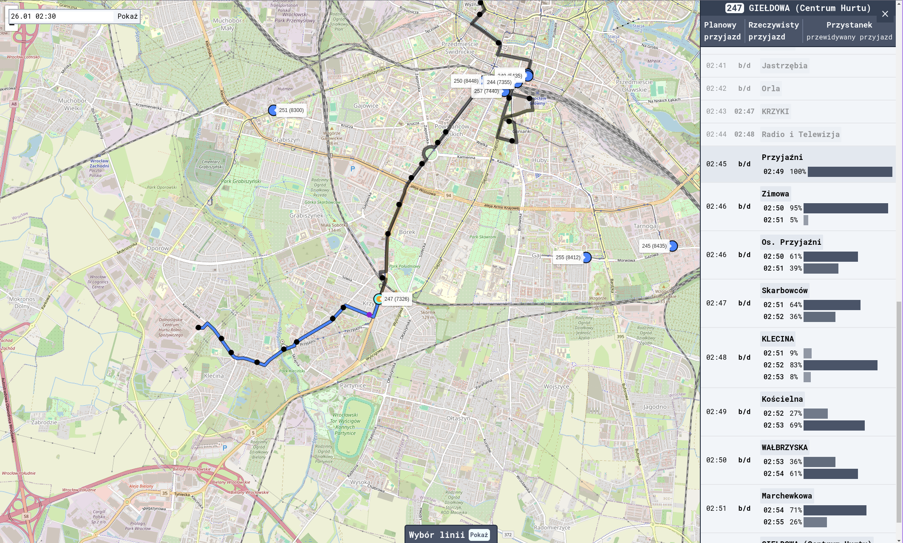

timepred
========

A Django app implementing a system for predicting the arrival time of public transport vehicles based on probabilities. The predictions are given in the form "The bus will arrive at 11:13 with a 10% chance; 11:14 with a 26% chance; 11:15 with a 34% chance; ...".

It is currently not available online.
